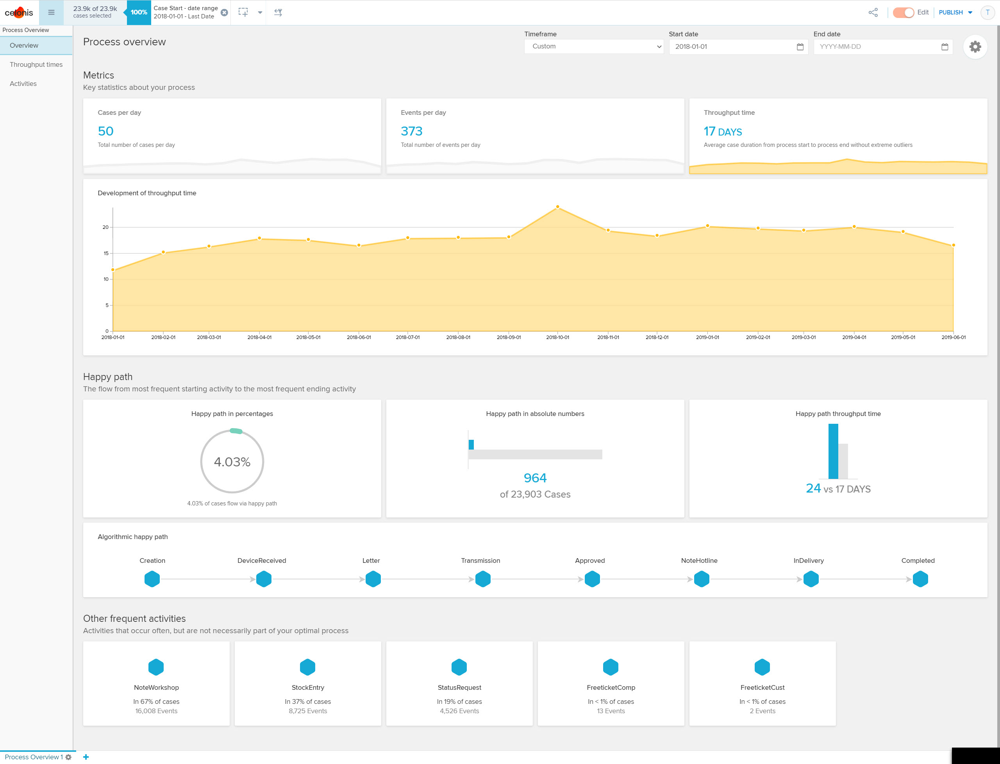

```{r setup, include=FALSE}
require(dplyr)
require(broom)
require(ggplot2)
require(cluster)
require(bupaR)
require(tidyverse)
require(daqapo)
library("tidyverse")
library(dplyr)
library(bupaR)
library(daqapo)
library(broom)
library(ggplot2)
library(cluster)

# using pacman to laod and install any packages
install.packages("pacman")

# load packages
pacman::p_load(pacman, tidyverse, rio, dplyr, ggplot2, plotly, tidyr, rmarkdown, tinytex, lubridate, gridExtra, scales, bupaR, daqapo, processmapR, cowplot, ggcharts)

knitr::opts_chunk$set(echo = TRUE)
```

Lucca Baumgärtner        (22699532)  
Theresa Riegel            (22527270)
Christopher Minderlein    (22484855)

# Introduction

ACME is a manufacturer for premium quality blenders "made in germany". Their unique selling point is the user experience, provided by the touch screens on their devices. High customer satisfaction is seen as the key to customer loyalty and should be achieved through communication and kind service. This is why all devices come with a five year warranty by default. In case of a malfunction, the customers can visit the local servicepoint in Nuremberg, where the device will be taken in for repair.

Surveys have shown that the current service process is far from optimal, resulting in a lower customer satisfaction. In order to improve the process, we will perform an extensive analysis of the current process, identify the weaknesses and bottlenecks and provide suggestions for improvement.

The basis for this analysis is an event log, provided by ACME. The logfile will be analyzed using the programming language R and the process analytics software Celonis.

# Process analytics

In this section we will perform analyses on the provided dataset. First we have to ensure the integrity and consistency of the data, otherwise the results cannot be trusted. After cleaning and preparing the data, we will extract relevant information about the process and meaningful conferences from it. We'll do this by applying basic aggregation and visualization techniques but also through the use of unsupervised machine learning and the powerful process analytics suite Celonis.

## Information gathering

First we'll have to get a general overview of the dataset, its dimensions and attributes.

```{r events, include=FALSE}
event_log <- read_delim("./data/event_log.csv", delim=";")
```

```{r summary}
summary(event_log)

```
This summary provides us with basic information about the attributes, saved for each event:

- CASE_ID (char)
- ACTIVITY (char)
- TIMESTAMP (datetime)
- REPAIR_IN_TIME_5D (int/boolean)
- DEVICETYPE (char)
- SERVICEPOINT (char)

To get a better idea of what the events look like, we output the first ten rows of the dataset.
```{r head}
head(event_log, n=10)

```

Of course this is only a small example of possible events. We want to know about all possible values contained in a certain column. Doing this, gives us a better idea of how many different devices or servicepoints there are, but also helps identifying possibly invalid values.
```{r uniques}
unique(event_log$ACTIVITY)
unique(event_log$DEVICETYPE)
unique(event_log$SERVICEPOINT)
unique(event_log$REPAIR_IN_TIME_5D)
```

From this output we can already identify two attributes that could cause problems later on in our analyses. It seems like some events didn't properly log the devicetype and the servicepoint, resulting in NA-values.

## Data cleaning

We know that there are Exclude logs without information about the servicepoint or the device type.

```{r na omit}
clean_events <- na.omit(event_log)
```

Create a subset of corrupt logs for further investigation.

```{r corrupted}
corrupted_events <- subset(event_log,is.na(DEVICETYPE) | is.na(SERVICEPOINT))
```


```{r chris data motification, echo=FALSE}
# cleaning the data and doing some tests
df_clean_logs <- as.data.frame(do.call(cbind, clean_events))

df_clean_logs$TIMESTAMP <- as.POSIXct(clean_events$TIMESTAMP, tz="",format="%Y-%m-%d %H:%M:%OS", optional = FALSE)
```

```{r creating df_mod_logs (a modificated copy of the base dataset), echo=FALSE}
df_mod_logs <- df_clean_logs

# creating DATE column (calculating for each row)
df_mod_logs$DATE <- with(df_clean_logs, as.Date(TIMESTAMP))

# creating WEEKDAY column
df_mod_logs$WEEKDAY <- weekdays(df_mod_logs$DATE)

# those cases started in 2013 and ended in 2018
sleeper_cases <- c("Case5304", "Case5502", "Case5544")

df_sleeper_cases <- df_clean_logs[df_mod_logs$CASE_ID%in%sleeper_cases,]
df_mod_logs <- df_mod_logs[!(df_clean_logs$CASE_ID%in%sleeper_cases),]

# checking if some case ids have datapoints with mixed rit values (rit = repair in time 5 days)
df_check_for_corrupt_repair <- df_mod_logs %>% group_by(CASE_ID) %>% summarise(ACTIVITY_COUNT = n(),
                                                                             RIT = first(REPAIR_IN_TIME_5D),
                                                                             RIT_GROUP_COUNTER = (table(REPAIR_IN_TIME_5D))[2],
                                                                             ERROR = !((RIT == 0 & 0 == RIT_GROUP_COUNTER) | (RIT ==1 & RIT_GROUP_COUNTER == ACTIVITY_COUNT))
                                                                             )
```

#### creating a new dataframe containing aggregated information per case_id

Here we are creating a new dataframe by grouping the modified and cleaned original dataframe by the variable "CASE_ID". We aggregate the seperate datapoints per "CASE_ID" into one, for example "THROUGHPUT_TIME_HOURS" is the the time between the first and last datapoint with the given "CASE_ID".
With "rit_cases_too_long" we are searching for cases which have the "REPAIR_IN_TIME_5D" flag and where our calculated throughput time is longer than 120 hours, which are exactly 5 days.

```{r create_new_dataframe_case_id_aggregats, echo=TRUE}
case_id_aggregated_information <- 
  df_mod_logs %>% group_by(CASE_ID) %>% 
  summarise(SERVICEPOINT = first(SERVICEPOINT),
            DEVICETYPE = first(DEVICETYPE), 
            ACTIVITY_COUNT = n(),
            START_DATETIME = min(TIMESTAMP), 
            END_DATETIME = max(TIMESTAMP),
            RIT = first(REPAIR_IN_TIME_5D), 
            THROUGHPUT_TIME_HOURS = 
              as.numeric(difftime(END_DATETIME, START_DATETIME, units="hours")),
            START_MONTH = month(START_DATETIME),
            START_YEAR = year(START_DATETIME),
)
# order dataset based on START_DATETIME
case_id_aggregated_information <- case_id_aggregated_information[order(case_id_aggregated_information$START_DATETIME, decreasing = FALSE),]
            
rit_cases_too_long <- case_id_aggregated_information[case_id_aggregated_information$RIT == 1 & case_id_aggregated_information$THROUGHPUT_TIME_HOURS>120,]
```

The amount of cases in the dataset which wrongly state that the repair was done in 5 days is 5157.
Even if we relax our check and add 48 hours as a weekend puffer, we still have 3472 cases, wronglly stating that the repair was done in 5 days.
```{r}
print(nrow(rit_cases_too_long))
print(nrow(rit_cases_too_long[rit_cases_too_long$THROUGHPUT_TIME_HOURS>168,]))
```
### new dataframe containing duration information of each activity log

```{r df creation, include=TRUE}
df_activity_information <- 
  df_mod_logs %>% 
  group_by(CASE_ID, ACTIVITY) %>%
  summarise(
    START_TS = min(TIMESTAMP)
  )

calc_duration = function(x){
  current_activity <- x[2]
  current_case_id <- x[1]
  current_activity_ts <- as.POSIXct(x[3], tz="UTC",format="%Y-%m-%d %H:%M:%OS", optional = FALSE)
  
  # print(paste("current case id: ", current_case_id))
  # print(paste("current activity: " , current_activity))
  # print(paste("current activity ts: " , current_activity_ts))
  
  ts_df <- as.data.frame(select(df_mod_logs[df_mod_logs$CASE_ID == current_case_id & df_mod_logs$ACTIVITY != current_activity, ], ACTIVITY, TIMESTAMP))
  # renaming
  names(ts_df)[names(ts_df)=="ACTIVITY"] <- "NEXT_ACTIVITY"
  names(ts_df)[names(ts_df)=="TIMESTAMP"] <- "NEXT_ACTIVITY_TS"
  
  # print(ts_df$TIMESTAMP)
  
  ts_df <- ts_df[(difftime(ts_df$NEXT_ACTIVITY_TS, current_activity_ts)>0), ]
  
  ts_df[order(ts_df$NEXT_ACTIVITY_TS), ]
  
  # print(ts_df$TIMESTAMP)
  # print(ts_df$ACTIVITY)
  
  re <- ts_df[1:1, ]
  re$ACTIVITY <- current_activity
  re$CASE_ID <- current_case_id
  
  return(re)
}

re_list <- apply(df_activity_information, 1 , calc_duration)
print("apply done")
re_df <- as.data.frame(do.call(rbind, re_list)) 

merge_columns <- c("CASE_ID", "ACTIVITY")
df_activity_information <- merge(df_activity_information, re_df, by=merge_columns, all.x = TRUE)

df_activity_information$DURATION = difftime(df_activity_information$NEXT_ACTIVITY_TS, df_activity_information$START_TS, units = "hours")

```

The creation of the dataset "df_activity_information" takes a lot of time, so we load it manually after it was created once.
```{r load dataset instead of building it, echo=FALSE}
# read activity information from base dataset
# df_activity_information <- read_delim(
# "data/activity_information.csv",
#  delim=','
# )
```

## Data analytics

### Number of unique service cases
```{r unique cases}
unique(clean_events$CASE_ID) %>% length()
```

## Basic univariate plotting

In the following we are getting a better feel for our data with visual data exploration by doing basic univariat plotting.

### Plotting the frequency of our qualitative variables:
```{r univariate_plotting, echo=FALSE, fig.width = 11}

par(mfrow = c(3:2))

# activity count
activity_count <- table(clean_events$ACTIVITY)
plot_logs_per_activitytype <- barplot(main="logs per activitytype", activity_count)

# rep in time
timely_repair <- table(clean_events$REPAIR_IN_TIME_5D)
plot_repair_in_time <- barplot(main="repair in 5 days", timely_repair)

# logs per devicetype
devicetypes_counter <- table(clean_events$DEVICETYPE)
plot_logs_per_devicetype <- barplot(main="logs per devicetype", devicetypes_counter)

# servicepoints
servicepoints <- table(clean_events$SERVICEPOINT)
barplot(main="logs per servicepoint",servicepoints)

# logs weekday
logs_per_weekday <- table(df_mod_logs$WEEKDAY)
barplot(main="logs per weekday", logs_per_weekday)

# logs per date
logs_per_date <- table(df_mod_logs$DATE)
plot(main="logs per date", logs_per_date)


```


### Looking at the throughput-time

Now we are going to take a look at the process throughput-time or the cases included in the dataset.

#### Overall throughput-time

Here we are plotting the raw per case data without aggregating or modifyin it in any way. As one can see the graphs are very full and chaotic and therefore hard to read.
Still you get the impression of a trend towards shorter throughput-times.
In the following graphs, the red line denotes 120 hours and the orange line 168 hours.

```{r basic plotting the case_id_aggregated_information dataset, fig.width = 14}
ggplot_lines_tp_time_per_case <-
ggplot(case_id_aggregated_information, aes(x = START_DATETIME, y = THROUGHPUT_TIME_HOURS)) + 
  geom_line(color = "darkorchid4", size=.1) +
  geom_hline(yintercept = 120, size=0.3, color="red")+
  geom_hline(yintercept = 168, size=0.3, color="orange")+
  labs(title = "Throughput time (in hrs) per case sorted by start date",
           y = "Throughput time in hours",
           x = "Start datetime")

ggplot_point_tp_time_per_case <-
ggplot(case_id_aggregated_information, aes(x = START_DATETIME, y = THROUGHPUT_TIME_HOURS)) + 
  geom_point(color = "darkorchid4", size=.2) +
  geom_hline(yintercept = 120, size=0.3, color="red")+
  geom_hline(yintercept = 168, size=0.3, color="orange")+
  labs(title = "Throughput time (in hrs) per case sorted by start date",
           y = "Throughput time in hours",
           x = "Start datetime")

grid.arrange(ggplot_lines_tp_time_per_case, ggplot_point_tp_time_per_case, ncol = 2)
```

#### Plotting throughput-time of RIT cases (Repair in 5 Days)

When plotting the RIT cases vs the non RIT cases, RIT meaning "Repari in time (in the range of 5 days)", we again see, that a lot of cases marked as RIT take way longer than 120 our even 168 hours.

```{r fig.align="center", echo = FALSE,fig.width = 14}
gglines_tptime_rit_cases <- 
  ggplot(case_id_aggregated_information[case_id_aggregated_information$RIT == 1,], aes(x = START_DATETIME, y = THROUGHPUT_TIME_HOURS)) + 
  geom_point(color = "darkorchid4", size=.2) +
  geom_hline(yintercept = 120, size=0.3, color="red")+
  geom_hline(yintercept = 168, size=0.3, color="orange")+
  labs(title = "Throughput time (in hrs) of RIT cases ",
           y = "Throughput time in hours",
           x = "Start datetime")

gglines_tptime_rit_cases_hours_overflow <- 
  ggplot(case_id_aggregated_information[case_id_aggregated_information$RIT == 0,], aes(x = START_DATETIME, y = THROUGHPUT_TIME_HOURS))+
  geom_point(color = "darkorchid4", size=.2) +
  geom_hline(yintercept = 120, size=0.3, color="red")+
  geom_hline(yintercept = 168, size=0.3, color="orange")+
  labs(title = "Throughput time of non RIT cases",
           y = "Throughput time in hours",
           x = "Start datetime")

grid.arrange(gglines_tptime_rit_cases, gglines_tptime_rit_cases_hours_overflow, ncol = 2)
```

### Throughput-time on a monthly average

#### new dataframe containg throughput-time summaries per month

```{r tp-time per month dataset creation, echo=TRUE}
# grp by month
tp_time_monthly_avg <- 
  case_id_aggregated_information %>% 
  group_by(START_MONTH, START_YEAR) %>% 
  summarise(
    START_DT_MONTH = format(first(START_DATETIME), "%Y-%m"),
    TP_TIME_MEAN = mean(THROUGHPUT_TIME_HOURS),
    TP_TIME_MEDIAN = median(THROUGHPUT_TIME_HOURS),
    CASE_COUNT = n()
  )

# grp by month only rit cases
tp_time_monthly_avg_rit_cases <- 
  case_id_aggregated_information[case_id_aggregated_information$RIT == 1,] %>% 
  group_by(START_MONTH, START_YEAR) %>% 
  summarise(
    START_DT_MONTH = format(first(START_DATETIME), "%Y-%m"),
    TP_TIME_MEAN = mean(THROUGHPUT_TIME_HOURS),
    TP_TIME_MEDIAN = median(THROUGHPUT_TIME_HOURS),
    CASE_COUNT = n()
  )

```

#### plotting average throughput time per month

```{r tp-time per month, fig.width = 12}


ggplot(tp_time_monthly_avg, aes(x = START_DT_MONTH)) + 
  geom_col(aes(y=CASE_COUNT, group=1), fill="orange", alpha=0.6) +
  geom_line(aes(y=TP_TIME_MEAN*3, group=1), color="blue", size=.5) +
  geom_line(aes(y=TP_TIME_MEDIAN*3, group=1), color="red", size=.5) +
  
  scale_fill_identity(guide = "legend", label="red = mean", name=NULL) +
  scale_color_identity(guide = "legend", label="blue = medium", name=NULL) +
  theme(legend.position = "bottom") +
  scale_y_continuous(sec.axis =sec_axis( trans = ~ . /3, name="Throughput-time hours") ) +  #formats the 2nd axis
  guides(fill = guide_legend(order = 1),  color = guide_legend(order = 2))  +
  labs(title = "Throughput time (in hrs) per case sorted by start date - red=median, blue=mean", x ="Month", y="Case Count")

```
Here we cant confirm the trend towards a shorter throughput time, that we saw earlier.
In the first half of the timeline the mean line is a lot higher than the median line, showing that there are a lot of datapoints spreading upwards, pulling the mean higher.

```{r monthly average throughput time of RIT cases, fig.width = 12}
ggplot(tp_time_monthly_avg_rit_cases, aes(x = START_DT_MONTH)) + 
  geom_col(aes(y=CASE_COUNT, group=1), fill="orange", alpha=0.6) +
  geom_line(aes(y=TP_TIME_MEAN*3, group=1), color="blue", size=.5) +
  geom_line(aes(y=TP_TIME_MEDIAN*3, group=1), color="red", size=.5) +
  
  scale_fill_identity(guide = "legend", label="red = mean", name=NULL) +
  scale_color_identity(guide = "legend", label="blue = medium", name=NULL) +
  theme(legend.position = "bottom") +
  scale_y_continuous(sec.axis =sec_axis( trans = ~ . /3, name="Throughput-time hours") ) +  #formats the 2nd axis
  guides(fill = guide_legend(order = 1),  color = guide_legend(order = 2))  +
  labs(title = "Throughput time (in hrs) per case sorted by start date - red=median, blue=mean", x ="Month", y="Case Count")
```
Here the median is consistently lower than the mean, showing us that there is a considerabe amount of datapoints spreading towards very high throughput-time values, and therefore pulling the average upwards. The majority of the cases has  lower throughput-time thow, as shown by the median.

### Activity information

```{r}
df_activity_information_aggregated <-
  df_activity_information %>% 
  group_by(ACTIVITY) %>% 
  summarise(
    MEDIAN_DURATION = median(DURATION, na.rm=TRUE),
    MEAN_DURATION = mean(DURATION, na.rm=TRUE),
    MIN_DURATION = min(DURATION, na.rm = TRUE),
    MAX_DURATION = max(DURATION, na.rm = TRUE),
    AMOUNT = n(),
  )
```

#### Activity distribution

```{r activity distribution, fig.width= 12}

amount_chart <- 
  df_activity_information_aggregated %>%
  bar_chart(ACTIVITY, AMOUNT)

amount_chart +
   geom_text(aes(label = AMOUNT, hjust = 1.2), color = "white")
```
#### Activity durations

We calculate duration as the time between the start of the current activity and the next activity of a case.

```{r activity durations, fig.width = 16}

  ggplot(df_activity_information_aggregated, aes(x = ACTIVITY, group=ACTIVITY)) +
    geom_col(aes(y= MEDIAN_DURATION),fill = "red", position = "stack")+
    geom_col(aes(y= MEAN_DURATION), fill = "blue", alpha=0.3, position = "stack")+
    labs(title = "Average dration of activity - red=median, blue=mean", x ="Activity", y="Duration in hours")


```
We can observe an often way higher mean than median of the duration of the activities. This leads to the conclusion, that there is a considerable amount of cases where some activities take unusual long times.
The activities that most often take a long time are "Creation" and "Device Received". Since both of these activities occure fairly often, the high duration of them has a high importance if u want to decrease the overall process throughput-time.

### Distribution of events among servicepoints

In an ideal scenario, every servicepoint would work on the same amount of service cases. This way, the capacities would be used most efficiently. Of course, the real world is not an ideal scenario, as the following graphic shows. The events are distributed unevenly between servicepoints, with only a few servicepoints accounting for most of the logged events.

```{r sp-distro}
# servicepoints
servicepoints <- table(clean_events$SERVICEPOINT)

sp_df = as.data.frame(servicepoints) %>% rename(Servicepoint = Var1)

sp_distro_plot <- ggplot(data=sp_df, aes(x = Servicepoint, y= Freq, label= Freq)) +
  geom_bar(stat="identity") +
  geom_text(size = 3, position = position_stack(vjust = 0.5))

sp_distro_plot
```

### "Five-day-repair quota" by servicepoint

Also an interesting metric is the quota of service cases which are completed within five days, by servicepoint. We call this the "5-day-quota". This enables us to identify the most and least efficient servicepoints. We need to take into account that the cases are distributed unevenly, thats why we added the number of total cases per servicepoint to the bars.

```{r 5-day-quota}

# das reperaturzeit flag steht in jedem eintrag eines CASEs, uns langt aber ein 
# Eintrag je CASE
distinct_cases <- distinct(clean_events, CASE_ID, .keep_all = TRUE)

# nach Servicepoint gruppieren und die flags aufsummieren
by_servicep <- group_by(distinct_cases, SERVICEPOINT) %>%
  summarise(fivedaysum = sum(REPAIR_IN_TIME_5D), all = n())
# quote berechnen mit anzahl der "schnellen" CASEs
by_servicep$quota = by_servicep$fivedaysum / by_servicep$all * 100

# plot zeichnen
plot <- ggplot(data = by_servicep, aes(x=SERVICEPOINT, y=quota, label=all)) +
  geom_bar(stat="identity") + ylab("\"In time\" repair quota in %")+
  xlab("Servicepoint") +
  geom_text(size = 3, position = position_stack(vjust = 0.5))
plot
```

### Clusteranalysis of device robustness

ACME has a product portfolio of many different devices. We assume that these devices differ in processing quality, proneness to malfunction and longevity. The following cluster analysis aims to identify the most robust products and the most fragile ones, clustering them in quality groups. We define robustness through two factors: The total number of times that the observed device was brought in for service and secondly, the average time it took to repair it. This means that, per our definition, the most robust devices are the ones rarely brought in for service and when they are, their repair only takes a short amount of time.

```{r robustness, ig.width = 12}
case_total_duration <- group_by(clean_events, CASE_ID) %>%
  group_by(DEVICETYPE, .add = TRUE) %>%
  summarise(timemax = max(TIMESTAMP), timemin = min(TIMESTAMP), duration = timemax - timemin)

avg_duration_by_device <- case_total_duration %>%
  group_by(DEVICETYPE) %>%
  summarize(case_count = n(), avg_time = mean(duration))

avg_duration_by_device$avg_time <- as.numeric(avg_duration_by_device$avg_time, units="days")

ggplot(avg_duration_by_device, aes(case_count, avg_time)) + geom_point()
```

After performing the aggregations, needed to calculate the average repair time and total case count per device, we can display how the devices are distributed in these two dimensions. In the plot above, each dot represents a device. The closer the dot is to the top right, the less robust is the device.

Before performing a clusteranalysis, one has to determine the number of clusters that should be created from the data. Creating a dendrogram first, can help to decide what number of clusters makes sense.

```{r dendro, fig.width = 12}
h.cluster <- avg_duration_by_device %>% dist(., method = "euclidean") %>% hclust(., method="ward.D")
plot(h.cluster)

```

The dendrogram shows that the ideal number of clusters is between 2-3. With this information we proceed to create the final clusters.

```{r cluster, ig.width = 12}

p.cluster <- avg_duration_by_device %>% select(avg_time, case_count) %>% kmeans(., 3)
p.cluster$cluster <- as.factor(p.cluster$cluster)

ggplot(avg_duration_by_device, aes(case_count, avg_time, label = DEVICETYPE)) + 
  scale_fill_discrete(name = "Cluster") + 
  geom_label(aes(fill = p.cluster$cluster), colour = "white", fontface = "bold", size = 2)
```

### Case lifetime

Using a library called 'bupar', an R library for process analysis, it's possible to visualize the lifetime of all cases, and their individual events.

```{r bupar, ig.width = 12}

# read dataset
bupar_events <- clean_events
nrow <- nrow(bupar_events)
# reformat dataset to fit bupar requirements
instance_id_vec <- c(1:nrow)
bupar_events$ACTIVITY_INSTANCE <- instance_id_vec

bupar_events$STATUS <- "complete"

# remove logs before 2017
bupar_events <- filter(bupar_events, TIMESTAMP >= as.Date("2017-01-01"))

# define eventlog for bupar
acme_actlog <- bupar_events %>%
  eventlog(
    case_id = "CASE_ID",
    activity_id = "ACTIVITY",
    activity_instance_id = "ACTIVITY_INSTANCE",
    lifecycle_id = "STATUS",
    timestamp = "TIMESTAMP",
    resource_id = "SERVICEPOINT"
  )
acme_actlog %>% dotted_chart(x = "absolute", y = "completed")

```

Each horizontal line represents one unqiue case. The colored dots on the line represent the activities. A lot of dots are 'scattered' in the top right corner of the plot. This means that the cases extend over a long period of time, sometimes even over years. Ideally the plot should display one thick diagonal line, implicating that all cases are completed within a similar timespan. Observing the line 'dissolving' to the right, means that a lot of cases take more time then they should.

## Celonis

Note: Cases before the year 2018 were erased as in previous analytics because first ones documented were in 2013, but marked with throughput times of 5 years and some missing entries. From 2014 to 2017, there were no cases.

"Happy Path" + average throughput time per month:
This "Happy Path" in the picture shows an optimal sequence of activities. It takes about 24 days to process, all paths (without extreme outliers) got a 17 days average duration. Including these outliers, the  average throughput time is at 20 days (compare picture 3: Bottlenecks). The Happy Path involves the activities Creation, DeviceReceived, Letter, Transmission, Approved, NoteHotline, InDelivery and Completed in this order.
Throughput time was on its maximum in October 2018 (24 days) and took 20 days in January 2019, February 2019 and April 2019, which is the second highest duration.



Happy Path is the most common path.


"Happy Path" + average case number per day in one month:
The case count was highest in October 2018 (103 cases), February 2019 (107), March 2019 (102) and April 2019 (103).
Regarding the previous celonis analysis, the average throughput time per month and the average amount of cases per day in one month can be put in relation to each other, the more cases per day, the longer the throughput times.


Bottlenecks:
The Bottleneck Analysis reveals exceedingly time consuming activities.


# Business implications

## Optimizing load distribution and working steps
Currently the distribution of the workload among the servicepoints is suboptimal. The servicepoints E and L account for the majority of events, while A - D barely logged anything. This leads us to the assumption that most of the service cases are being processed by those SPs. We expect that an equal distribution of the workload between all available SPs would lead to an increase in repair speed and total capacity.

Due to the relation of average throughput time per month and the average amount of cases per day in one month, as seen in the first two celonis analytics, we recommend working faster, optionally with additional employees or overtime hours, instead of slowlier while more devices are sent in.

Some of the activity connections in the Bottleneck Analysis from celonis which cost 1 day or more to process should be revised, especially the ones with throughput time increase of 5 days or more. 
For example, 10% of the steps from NoteWorkshop to InDelivery can take the maximum process delay of 10 days. Due to this, the packing and sending of the devices should be sped up. Other relevant consecutive activities to improve are DeviceReceived->InDelivery, DeviceReceived->Letter, NoteHotline->InDelivery, which take 5 or more days and affect 25% or more each. Often, there is a delay after the activity DeviceReceived, so it should be investigated why further actions such as Transmission or Letter take an unnecessarily long time to be executed.
Creation->DeviceReceived with 54% of affected cases and 6 days of delay can't be altered since the customer is in charge to send the device after the service task creation and the delivery time can't be influenced.


## Error-prone devices
Different devices have a different proneness to technical failure. The underlying assumption is that those devices which are most likely to fail, will be brought in for service the most often. Also the devices differ in how long it takes on average to repair them. Using these two factors, one can estimate how service and resource intensive these devices are during their lifetime.

The cluster analysis shows which devices are the most resource intensive ones by dividing them into three groups. The most error-prone device, with over 3000 service cases in the observed timespan and an average repair time of 27 days is the model AB52. We suggest removing this device from the product portfolio, as frequent failure of the device has a negative impact on customer satisfaction. 


## Improve data collection
In order to perform detailed analysis of the service process, more data about the timing of activities is needed. Currently only the completion time of an activity is logged. We recommend to also track the start time of each activity. This way it's possible to make statements about the real duration of the activity and possible idle-times. As of now, it's impossible to say if an activity took a lot of time or if there was a lot of idle-time before it started.
Also there were some event logs without information about the associated servicepoint. We recommend to install mechanisms that prevent incomplete logs from being saved.


